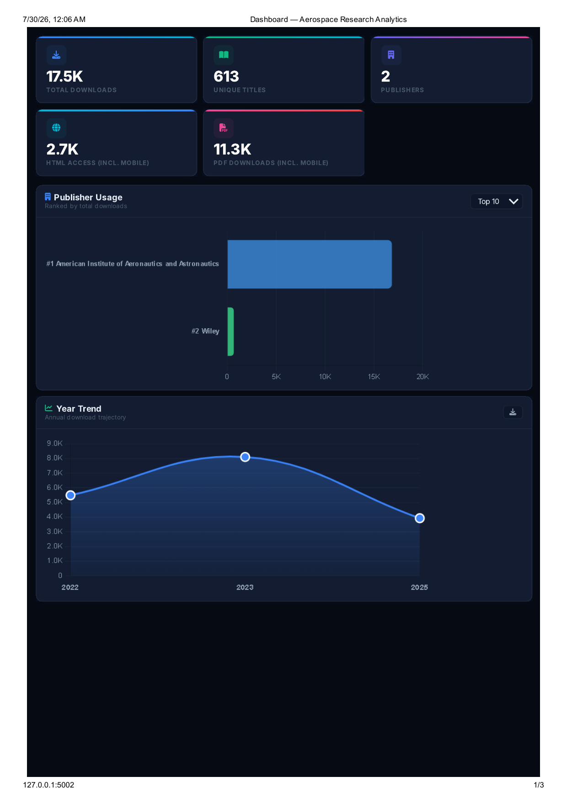
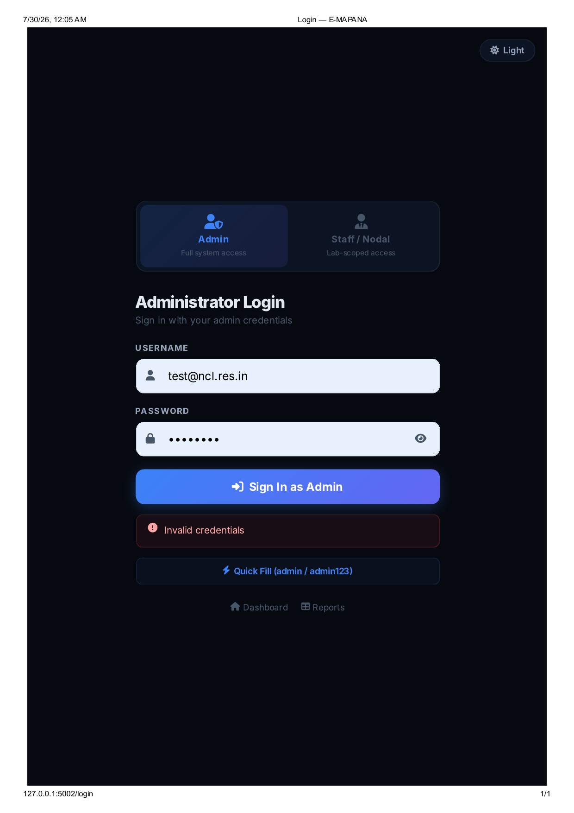
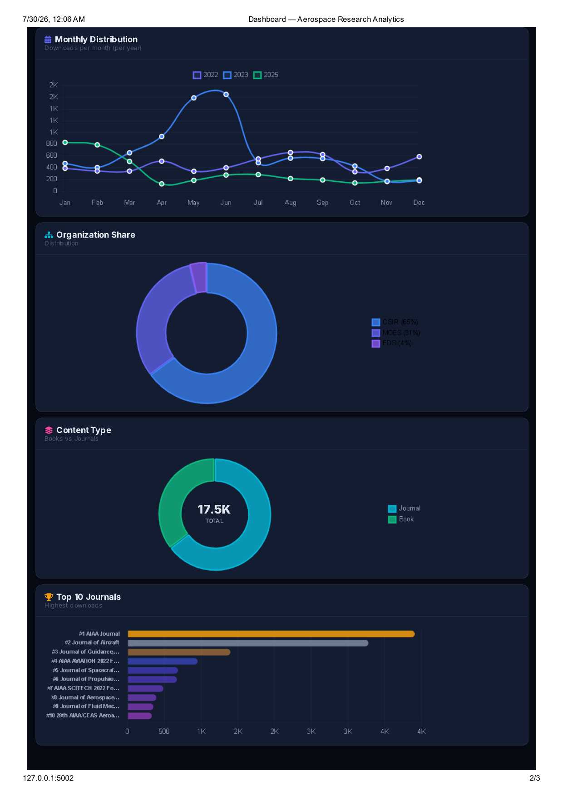
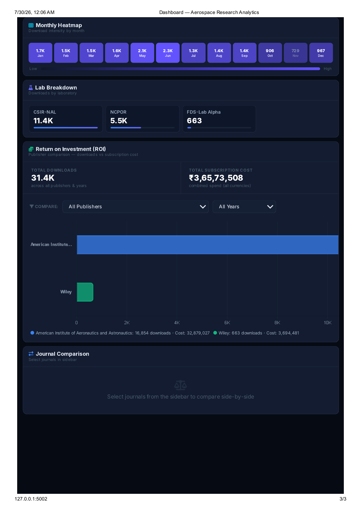

# Research Usage & ROI Analytics Platform

> ⚠️ **This repository is a case study, not a code release.** The codebase was developed for CSIR-National Aerospace Laboratories (NAL) and is their property — it cannot be shared publicly. This document describes the project scope, architecture, and my contributions.


---

## Overview

This platform helps multi-site research organisations (CSIR, MOES, and affiliated labs) track how researchers use subscribed academic journals, and calculate the Return-on-Investment (ROI) of those subscriptions.

It was developed during a Data Science internship at **CSIR-National Aerospace Laboratories (NAL)** (Feb–May 2026), as part of a two-person team, under the guidance of **Smt. Jayashree S, Principal Scientist, ICAST**, with oversight from **Dr. B. S. Shivaram, Head, ICAST, CSIR-NAL**.

The completed project was presented at a national-level review in New Delhi and accepted as production-ready.

---

## Problem It Solves

Research labs subscribe to expensive academic journal packages but had no systematic way to measure whether those subscriptions were being used effectively. The platform ingests standardized COUNTER R4 usage-report files exported by publishers and turns them into actionable analytics and cost-justification data for decision-makers — showing exactly what the organisation pays per download, per journal, per lab.

---

## Screenshots

<!--
Add your screenshots to a folder named "screenshots" in this repo,
then reference them below. Example:


-->

### Login


### Dashboard — Overview


### Dashboard — Trends & Breakdown


### Dashboard — ROI & Heatmap


### Upload


---

## Key Features

- **COUNTER R4 File Ingestion** — parses multiple industry-standard usage report formats (TR1, JR1, JR1c, JR5) from Excel files, handling inconsistent column naming across different publishers via an alias-mapping system
- **Automated Data Pipeline** — a 6-step preprocessing pipeline that extracts metadata, locates headers dynamically, parses data rows, deduplicates entries, and cleans invalid records
- **ROI Analytics Module** — calculates cost-per-access, cost-per-download (USD & INR), and ROI multipliers per publisher, with live currency exchange rate fetching (and offline fallback rates)
- **Role-Based Access Control** — Admin (full control), Staff/Nodal Manager (restricted to their own lab, validated via institutional email domain), and public Viewer access for dashboards
- **Interactive Dashboards** — usage breakdowns by organisation, lab, publisher, and year, with CSV export
- **Duplicate Prevention** — dual-layer checks (file hash + organisation/lab/publisher/year combination) to prevent double-counting of uploaded data

---

## Tech Stack

| Layer | Technology |
|---|---|
| Backend | Python, Flask |
| Database | PostgreSQL (via psycopg2) |
| File Processing | openpyxl (custom COUNTER R4 parser, no pandas dependency) |
| Auth | Token-based sessions, domain-restricted staff login |
| Config | python-dotenv for environment-based secrets management |

---

## Why a Custom Pipeline, Not Just `pandas.read_excel()`?

COUNTER R4 reports look "standardized" on paper, but every publisher exports slightly different column names, header row positions, and metadata blocks inside the same Excel format. A generic `pandas.read_excel()` call breaks the moment a publisher renames a column or shifts the header.

The pipeline instead:

1. Scans the first 30 rows for metadata (report type, institution, reporting period)
2. Scans up to 50 rows to dynamically locate the real header row (first row containing both "Title"/"Journal" and "Publisher")
3. Maps every text header cell through a `COLUMN_ALIASES` dictionary to a canonical name (e.g. "journal name", "title name" → `title`)
4. Detects datetime cells automatically and renames them `month_YYYY_MM`, regardless of how the publisher formatted the date
5. Stops parsing cleanly at section markers (e.g. a JR5 block appearing after JR1 data) instead of misreading unrelated sections as journal rows

---

## Supported COUNTER R4 Formats

| Format | Detected By | Notes |
|---|---|---|
| TR1 — Title Report 1 | Header cell contains "Title Report 1 (R4)" | Covers both journals and books; a `data_type` column distinguishes them |
| JR1 — Journal Report 1 | Header cell contains "Journal Report 1 (R4)" | Journals only; no `data_type` column, so it's set to `"Journal"` automatically |
| JR1c — Compact JR1 | Same header as JR1 but no monthly datetime columns | Totals only, no month-by-month breakdown stored |
| JR5 | Year-of-publication breakdown columns | Treated as a section marker — parsing stops here, not processed |

---

## System Architecture

```
                    ┌───────────────────────────┐
                    │  Publisher Usage Reports  │
                    │ (.xlsx — TR1/JR1/JR1c/JR5)│
                    └─────────────┬─────────────┘
                                  │ upload (Admin or Staff)
                                  ▼
                    ┌───────────────────────────┐
                    │   Duplicate Prevention    │
                    │ 1. SHA-256 file hash check│
                    │ 2. (org,lab,pub,year)check│
                    └─────────────┬─────────────┘
                                  ▼
                    ┌───────────────────────────┐
                    │    6-Step Preprocessing   │
                    │  1. Load & validate       │
                    │  2. Extract metadata      │
                    │  3. Locate header row     │
                    │  4. Map columns (aliases) │
                    │  5. Parse data rows       │
                    │  6. Clean, dedupe & return│
                    └─────────────┬─────────────┘
                                  ▼
                    ┌───────────────────────────┐
                    │Bulk Insert (execute_values)│
                    │One journal-dict → N monthly│
                    │        database rows      │
                    └─────────────┬─────────────┘
                                  ▼
                    ┌───────────────────────────┐
                    │    PostgreSQL Database    │
                    └─────────────┬─────────────┘
                                  ▼
                ┌─────────────────┴─────────────────┐
                ▼                                     ▼
      ┌───────────────────┐             ┌───────────────────────┐
      │   ROI Analytics   │             │  Role-Based Dashboards│
      │  cost/access, cost │             │  Admin · Staff (lab- │
      │ /download, ROI mult│             │  scoped) · Public    │
      │ live FX rates      │             │  usage trends, top-  │
      │                    │             │  journal rankings, CSV│
      └───────────────────┘             └───────────────────────┘
```

---

## Database Schema

| Table | Purpose | Key Columns |
|---|---|---|
| `usage_data` | Core analytics table — one row per journal per month | `journal, publisher, doi, year, month, downloads, html_total, pdf_total, organization, lab, upload_id` |
| `uploads` | One row per uploaded file — metadata + dedup hash | `filename, organization, lab, publisher, data_year, rows_imported, file_hash, uploaded_by` |
| `roi_costs` | Subscription costs entered by admin/staff | `organization, lab, publisher, year, cost_usd, usd_to_inr, notes` |
| `staff_users` | Staff portal accounts | `full_name, email, password_hash, organization, lab, status, must_change_password` |
| `master_data` | Admin-managed list of orgs/labs/publishers | `type (org/lab/publisher), parent, name, email_domain` |

Six indexes are created automatically on startup (organization+lab, year, publisher, upload_id, file_hash, and uploads(org, lab)) to keep staff dashboard queries and duplicate-file checks fast without manual tuning.

> **Note on row expansion:** preprocessing returns one dict per journal (e.g. total downloads + 12 monthly counts in a single record), but the database stores one row per journal per month. An expansion step unpacks each `month_YYYY_MM` key into its own row — plus one summary row holding HTML/PDF totals — which is why the number of rows imported is always much larger than the number of journals found in a file.

---

## ROI Module — Formulas

| Metric | Formula |
|---|---|
| Cost (INR) | `cost_usd × usd_to_inr` |
| Total Accesses | `downloads + html_total + pdf_total` |
| Cost per Access | `cost ÷ total_accesses` (USD & INR) |
| Cost per Download | `cost ÷ downloads` (USD & INR) |
| ROI Multiplier | `(total_accesses ÷ cost_usd) × 1000` |

Live USD/GBP/EUR exchange rates are fetched with a 5-second timeout via `api.frankfurter.app`; if the call fails, the system falls back to a hard-coded table of approximate annual average rates (2015–2026).

---

## Access Control

| Role | Login Method | Scope |
|---|---|---|
| Admin | Username/password → UUID session token | Full control — uploads, ROI cost entry, staff account creation, all orgs/labs |
| Staff / Nodal Manager | Email/password, email domain validated against the registered domain for their lab (e.g. `@nal.res.in`) | Own lab only — upload usage files, view own lab's analytics |
| Viewer | No login required | Public dashboard and analytics — read-only |

---

## Key Specifications

| Parameter | Value |
|---|---|
| Report formats supported | TR1, JR1, JR1c, JR5 (COUNTER R4 standard) |
| Input file type | Excel (.xlsx/.xls), multi-publisher, inconsistent schemas |
| Parsing library | openpyxl (no pandas dependency) |
| Pipeline stages | 6 (load/validate → metadata → header detection → column mapping → row parsing → clean/return) |
| Database | PostgreSQL (psycopg2) |
| Auth model | Token-based (UUID session tokens) |
| Access roles | Admin, Staff/Nodal Manager, Viewer |
| Duplicate prevention | SHA-256 file hash + (org, lab, publisher, year) composite check |
| Insert strategy | Bulk insert via `psycopg2.extras.execute_values()` — single round-trip |
| Export | CSV |
| Team size | 2 |
| Internship duration | Feb 2026 – May 2026 |
| Outcome | Presented at national-level review, New Delhi — accepted production-ready |

---

## My Contribution

Worked as part of a two-person team on the ingestion pipeline and analytics/ROI dashboard — specifically:

- Preprocessing logic that converts raw, unstructured publisher files into standardized database records (metadata extraction, header detection, column-alias mapping, deduplication)
- Dashboard features including top-read-journal rankings and usage trend tracking

---

## Roadmap (as delivered at internship completion)

- [x] COUNTER R4 multi-format ingestion (TR1, JR1, JR1c, JR5)
- [x] Column-alias mapping across publishers
- [x] Two-layer duplicate prevention (file hash + composite key)
- [x] PostgreSQL schema design with automatic indexing
- [x] Bulk-insert pipeline via `execute_values()`
- [x] ROI calculation module with live FX rates + offline fallback
- [x] Role-based access control (Admin / Staff / Viewer)
- [x] Usage-trend and top-journal dashboards with CSV export
- [x] Presented at national-level review, New Delhi — accepted production-ready

---

## Note on Scope

This repository intentionally contains no source code. It exists to document the system design and my role in building it, in line with confidentiality requirements for work completed at a government research organisation. The architecture, schema, and formulas above are drawn from internal project documentation, not extracted from a live public codebase.
